# Diagramas de Secuencia — ClubRank

> Diagramas en formato **Mermaid**. Se visualizan automáticamente en GitHub, GitLab, VS Code (con la extensión "Markdown Preview Mermaid Support"), Typora, Obsidian, y otros editores de Markdown compatibles.
> Alcance actual: solo **Web responsive (MVP)**. La API es API-first y será reutilizada sin cambios por la futura App móvil nativa.

---

## 1. Registro de Admin y creación de organización

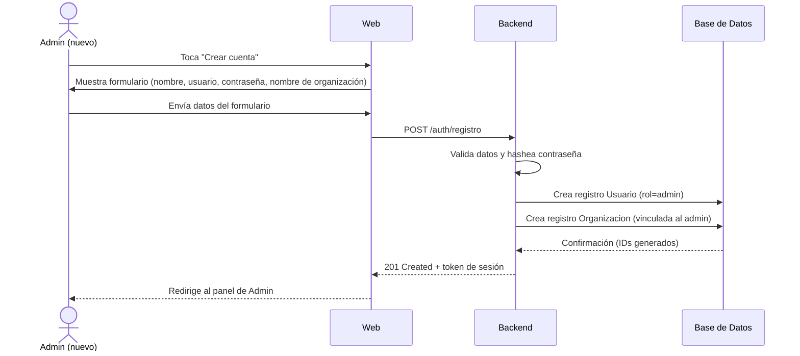

---

## 2. Inicio de sesión (Admin, Staff o Director)

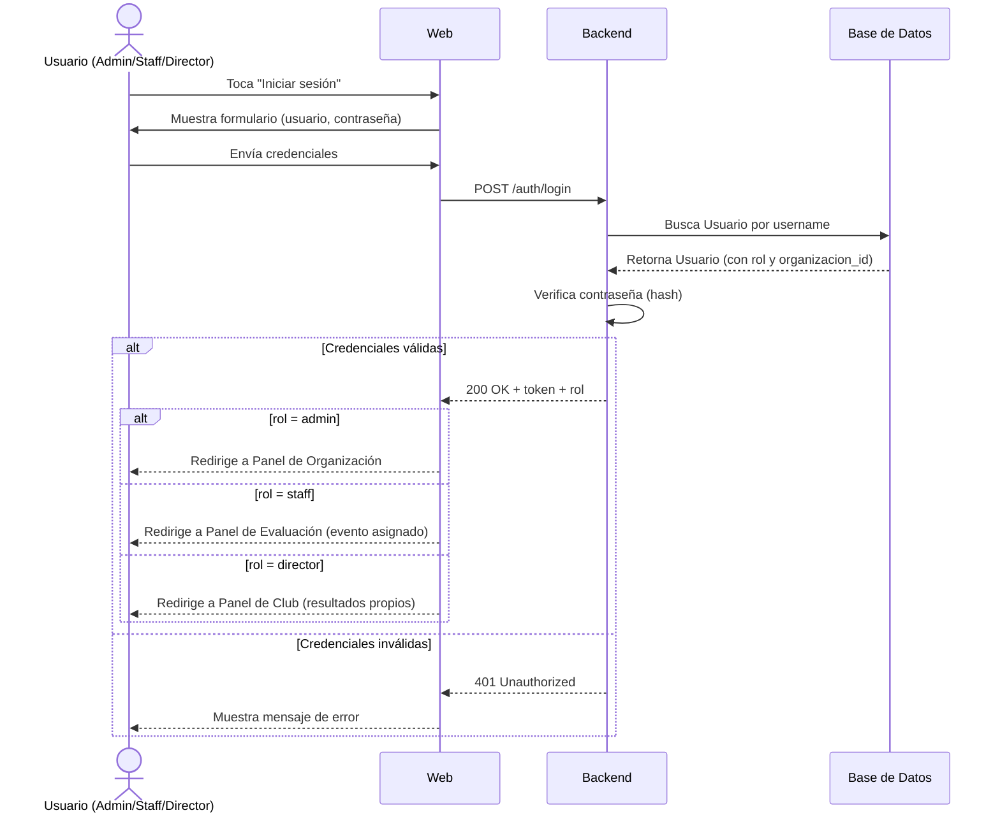

---

## 3. Creación de evento, definición de puntaje máximo y generación masiva de accesos

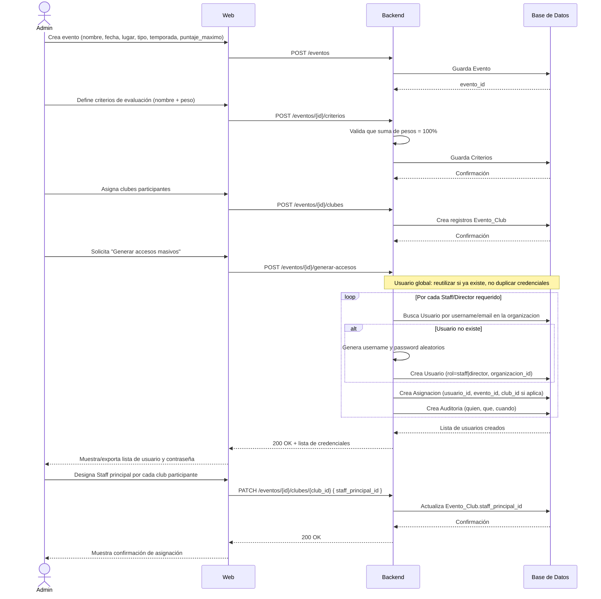

---

## 4. Evaluación de un club por Staff

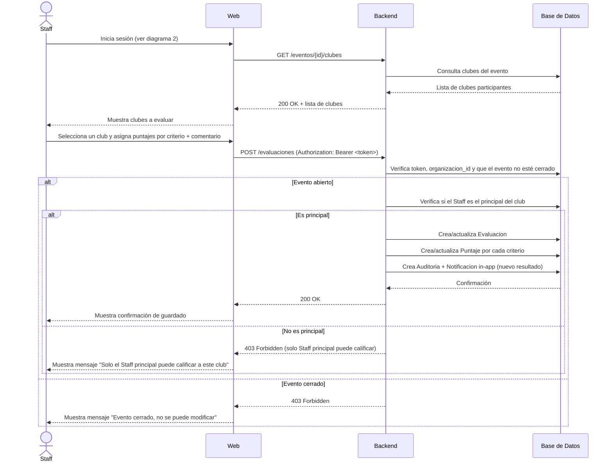

---

## 5. Staff reporta un incidente

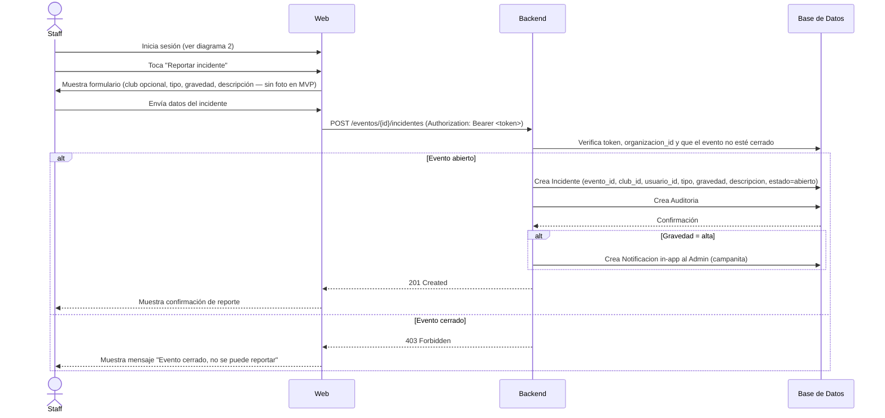

---

## 6. Admin gestiona incidentes reportados

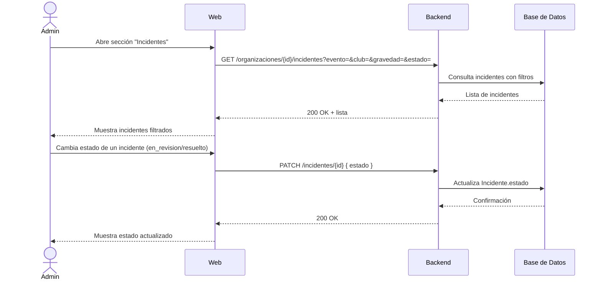

---

## 7. Admin crea motivo de penalización y Staff lo aplica

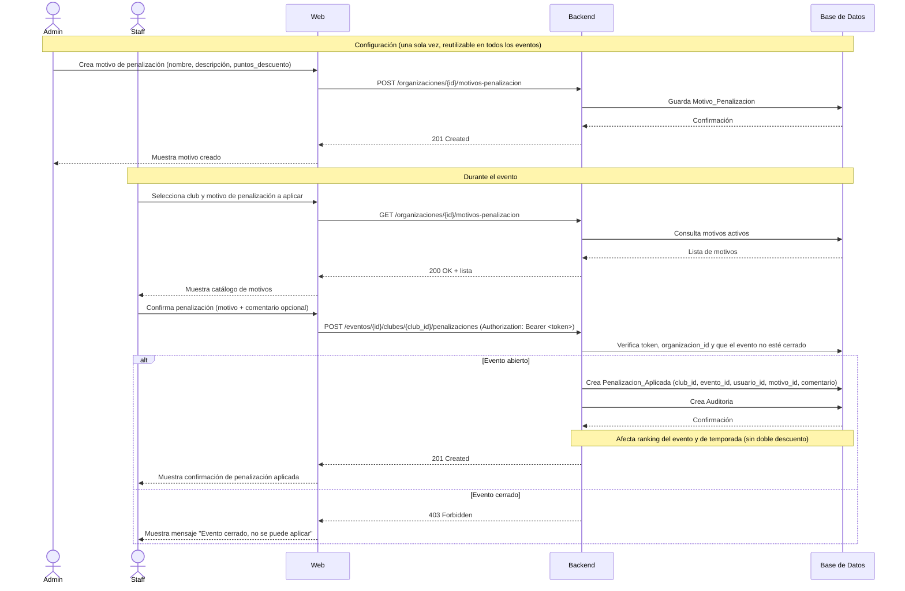

---

## 8. Cierre de evento y cálculo de resultados

```mermaid
sequenceDiagram
    actor Ad as Admin
    participant UI as Web
    participant API as Backend
    participant DB as Base de Datos

    Ad->>UI: Solicita "Cerrar evaluaciones" del evento
    UI->>API: GET /eventos/{id}/pendientes
    API->>DB: Consulta clubes sin evaluación del Staff principal
    DB-->>API: Lista de pendientes
    API-->>UI: 200 OK + resumen de pendientes
    UI-->>Ad: Muestra resumen (si hay pendientes, advierte antes de continuar)

    Ad->>UI: Confirma cierre del evento
    UI->>API: POST /eventos/{id}/cerrar
    API->>DB: Marca Evento.cerrado = true
    DB-->>API: Confirmación

    API->>DB: Obtiene Evaluacion del Staff principal de cada club participante
    DB-->>API: Datos de evaluaciones

    loop Por cada Club participante
        API->>API: Calcula porcentaje ponderado (Σ valor_criterio × peso/100)
        API->>API: Calcula puntaje_bruto = porcentaje × evento.puntaje_maximo
        API->>DB: Obtiene penalizaciones del club en este evento
        API->>API: puntaje_evento_final = puntaje_bruto − Σ penalizaciones_evento
    end

    API->>API: Ordena clubes por puntaje_evento_final descendente
    API->>API: Resuelve empates (criterio de mayor peso; si persiste, comparten posición)
    API->>DB: Guarda ranking del evento
    API->>DB: Crea Auditoria (cierre: quien, cuando)

    API-->>UI: 200 OK + ranking (1.º, 2.º, 3.º lugar)
    UI-->>Ad: Muestra ranking del evento
```

---

## 9. Pantalla de resultados: acumulado de temporada (por defecto) con filtro por evento

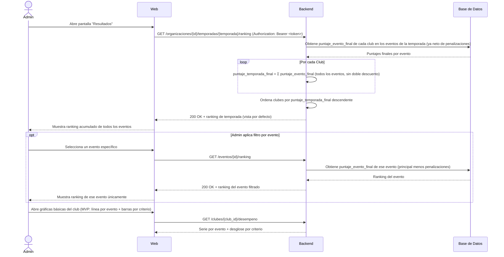

---

## 10. Admin proyecta "Mostrar resultado" (pantalla pública)

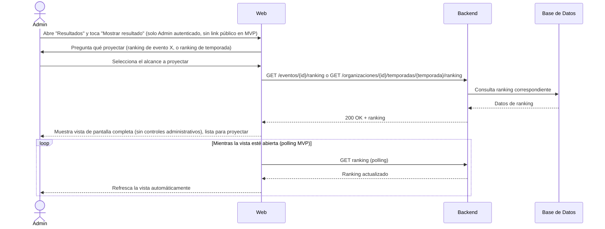

---

## 11. Director consulta resultados de su club

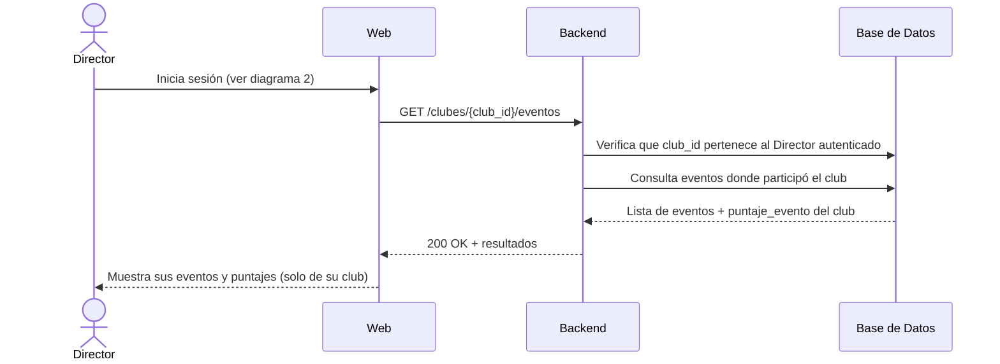

---

## 12. Exportar resultados a PDF/Excel

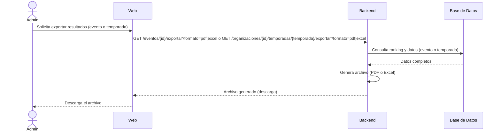

---

## 13. Importar miembros por Excel (plantilla exportable)

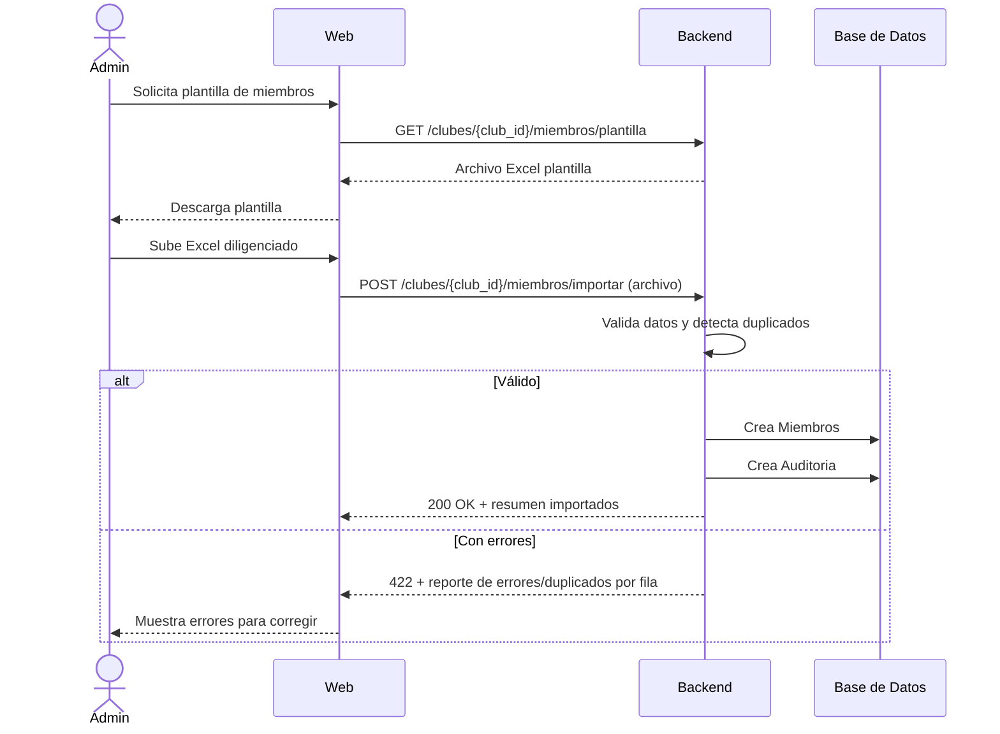

---

## 14. Reabrir evento y anular penalización (solo Admin + auditoría)

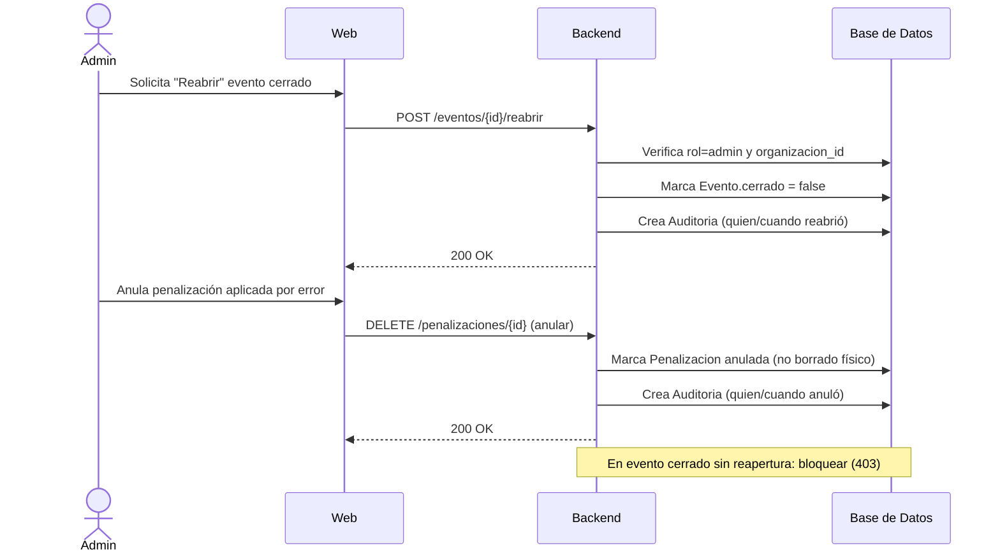

---

## 15. Reportes, actividad de staff y notificaciones in-app

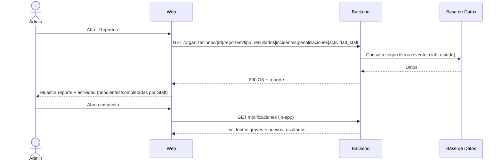
